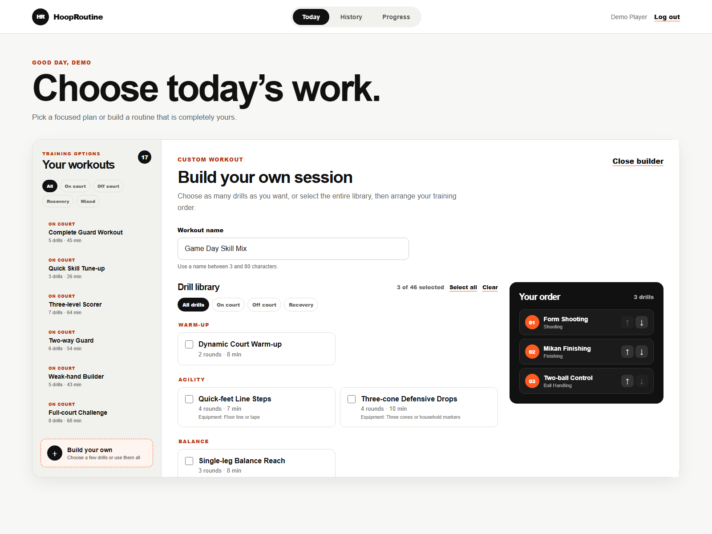
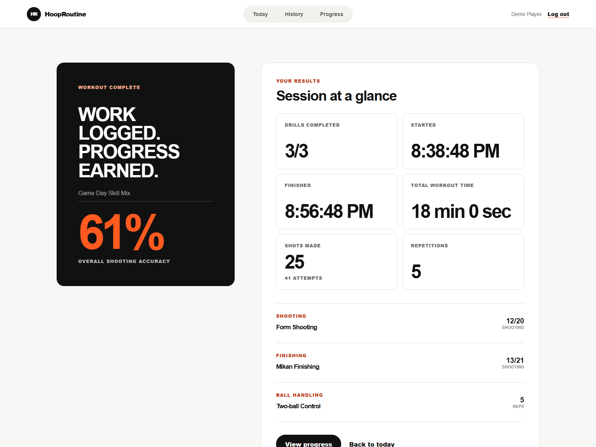
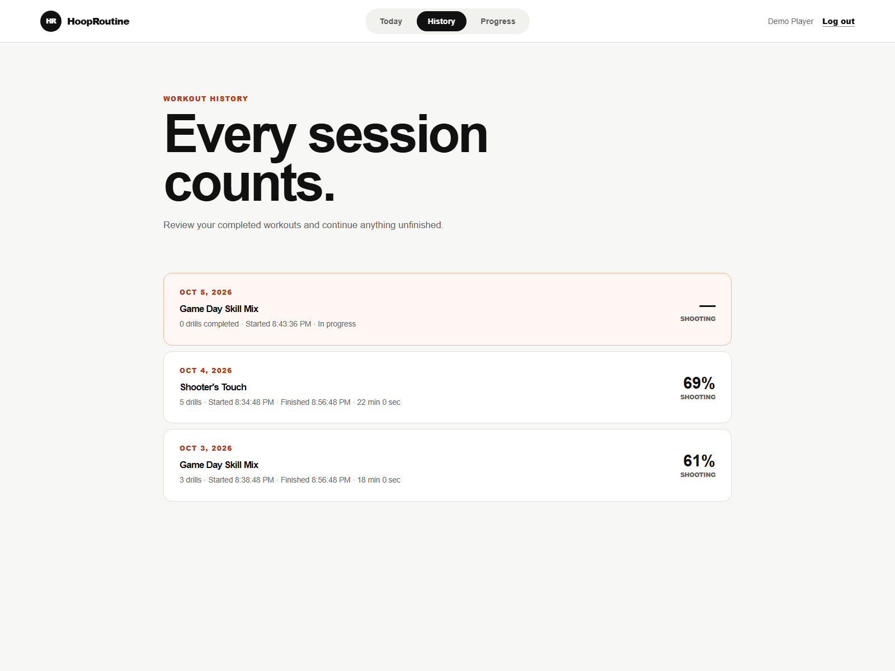
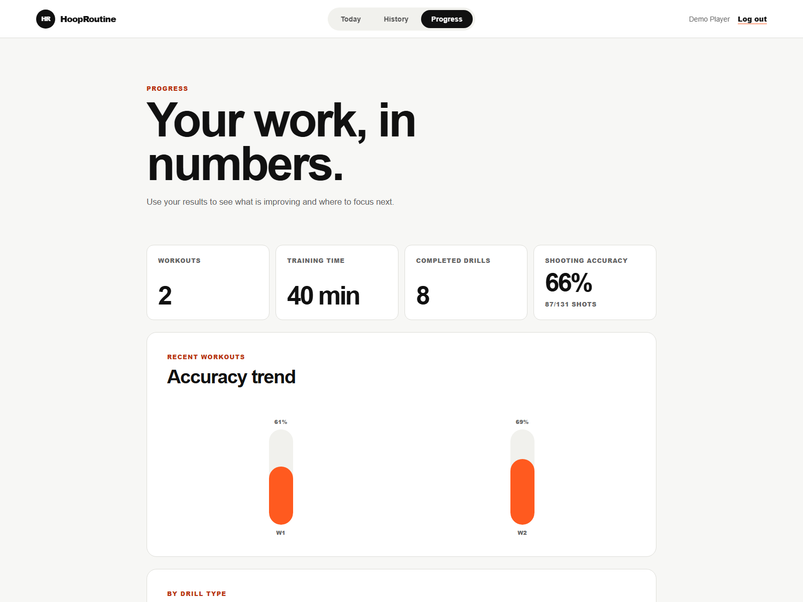

# HoopRoutine

**Basketball Training and Performance Tracker**

[](client/package.json)
[](client/package.json)
[](package.json)
[](server/package.json)
[](server/db/schema.sql)
[](AI-USAGE.md)

HoopRoutine helps basketball players choose a training plan, record what they did, and see their progress over time. Players can use a preset routine or arrange their own drills, then review completed sessions, shooting results, and training history.


## Live app and project links

| | Link |
| --- | --- |
| Application | [hooproutine.vercel.app](https://hooproutine.vercel.app/) |
| Database-backed API health | [hooproutine.vercel.app/api/health](https://hooproutine.vercel.app/api/health) |
| Source code | [Jaycenn/Hoop-Routine](https://github.com/Jaycenn/Hoop-Routine) |
| Development report | [REPORT.md](REPORT.md) |
| AI usage log | [AI-USAGE.md](AI-USAGE.md) |

The React client and Express API run on the same HTTPS origin in one Vercel Hobby project. The API uses the existing Neon PostgreSQL database. The public site and health endpoint returned HTTP 200 during the October 9 deployment check; the health endpoint returned `{"status":"ok"}` after a database query.

## Features

- **Accounts:** Register, log in, and log out. Workouts and sessions are scoped to the signed-in player.
- **Training plans:** Choose from 16 preset workouts and 46 drills across on-court, off-court, recovery, and mixed training. Preview instructions, targets, and equipment before starting.
- **Custom workouts:** Select drills, arrange their order, save a personal routine, and edit it later without changing past session history.
- **Workout recording:** Start or resume a session; record makes, attempts, rounds, time, completion, and notes; finish with a saved whole-session duration.
- **Review:** Open a Workout Summary, return to completed or unfinished sessions in History, and see totals and accuracy trends in Progress.
- **Responsive interface:** Layouts support common desktop, tablet, and phone widths.

### A typical session

1. Create an account or log in.
2. On **Today**, filter the plans, choose a preset, or select **Build your own**.
3. Open the drill guidance, check equipment, and start the workout.
4. Save each drill's result. You can leave an unfinished session and resume it from History.
5. Finish the workout and review its Summary, History entry, and Progress totals.

## Screenshots

These are real HoopRoutine captures from a local Week 3 run on October 5, 2026, using a dedicated demo account and illustrative results. They predate the latest October 9 code and deployment checks; review them against the current interface before using them as final submission images.

| Custom workout builder | Workout Summary |
| --- | --- |
|  |  |

| Workout History | Progress |
| --- | --- |
|  |  |

The [screenshot index](docs/screenshots/README.md) also links the login and active workout screens.

## Technology

| Layer | Tools | Role |
| --- | --- | --- |
| Client | React 18, React Router, Vite 6, CSS | Pages, forms, and responsive layouts |
| API | Node.js 22+, Express 5 | Authentication, validation, and workout routes |
| Database | PostgreSQL on Neon | Accounts, workout definitions, sessions, and results |
| Hosting | Vercel Hobby | Static client and Express function on one origin |

## Run locally

### Requirements

Install Node.js **22.12 or newer**, npm, Git, and PostgreSQL 17+ (locally or through a compatible hosted provider). Docker is optional for local PostgreSQL.

### 1. Clone and install

```powershell
git clone https://github.com/Jaycenn/Hoop-Routine.git
cd Hoop-Routine
npm --prefix server ci
npm --prefix client ci
Copy-Item server/.env.example server/.env
Copy-Item client/.env.example client/.env
```

On macOS or Linux, use `cp` instead of `Copy-Item`. If you already have working private `.env` files, keep them instead of overwriting them.

### 2. Configure PostgreSQL and the server

Edit `server/.env`. This is a **placeholder example**, not a credential to reuse:

```env
PORT=3001
DATABASE_URL=postgresql://postgres:<your-password>@localhost:5432/hooproutine
DATABASE_SSL=false
JWT_SECRET=<your-private-random-secret-of-at-least-32-characters>
CORS_ORIGINS=http://localhost:5173,http://127.0.0.1:5173
COOKIE_SAME_SITE=lax
NODE_ENV=development
TRUST_PROXY_HOPS=0
```

For Neon, use your **private** pooled connection URL and set `DATABASE_SSL=true`. Remote PostgreSQL connections require verified TLS. Never commit real credentials. The optional `DATABASE_CA` supplies a provider CA when required. The client's `client/.env.example` points `VITE_API_URL` to `http://localhost:3001/api`; keep that port aligned with `PORT`. Without `VITE_API_URL`, the client uses Vite's same-origin `/api` development proxy.

For a **new, empty database only**, create the schema, apply its ordered migration, and load the workout catalog:

```powershell
npm --prefix server run db:schema
npm --prefix server run db:seed
```

For an **existing database**, first run `npm --prefix server run db:status`. Back up and rehearse any pending migration on an isolated copy before running `db:migrate`. Do not use `db:schema`, `db:seed`, or `db:reset` as a routine upgrade command. Migration 001 is already applied to the existing production Neon database; no live seed or reset was run.

### 3. Start both services

Run these in two terminals from the repository root:

```powershell
npm run dev:server
```

```powershell
npm run dev:client
```

Open [http://localhost:5173](http://localhost:5173). You should see the Log in/Create account screen. [http://localhost:3001/api/health](http://localhost:3001/api/health) returns `{"status":"ok"}` when the API can reach PostgreSQL.

### Production configuration

[vercel.json](vercel.json) builds the Vite client and rewrites `/api/*` to [api/index.mjs](api/index.mjs), which exports the existing Express app. The deployment uses these Vercel environment variable names:

| Variable | Purpose |
| --- | --- |
| `DATABASE_URL` | Private Neon pooled connection URL |
| `DATABASE_SSL` | `true` for verified TLS |
| `JWT_SECRET` | Private random session-signing secret |
| `NODE_ENV` | `production` for secure cookie behavior |
| `CORS_ORIGINS` | Exact HTTPS origin, `https://hooproutine.vercel.app` |
| `COOKIE_SAME_SITE` | `lax` for the same-origin app |
| `TRUST_PROXY_HOPS` | `1` behind Vercel |

Keep values in Vercel's environment settings, never in Git or a `VITE_` variable. The Vercel project was deployed with the CLI; its GitHub connection was not established, so pushing code alone does not redeploy it.

## API overview

Workout, session, and progress routes require an authenticated session.

| Method | Route | Purpose |
| --- | --- | --- |
| `GET` | `/api/health` | Check API and database connectivity |
| `POST` | `/api/auth/register` | Create an account |
| `POST` | `/api/auth/login` | Log in |
| `GET` / `POST` | `/api/auth/me` / `/api/auth/logout` | Read or end the current login |
| `GET` | `/api/workouts`, `/api/workouts/today`, `/api/workouts/drills` | List plans and drills |
| `POST` / `PUT` / `DELETE` | `/api/workouts/custom`, `/api/workouts/:workoutId` | Create, version, or hide an owned custom plan |
| `POST` / `GET` | `/api/sessions`, `/api/sessions/:sessionId` | Start/resume or read owned sessions |
| `PATCH` | `/api/sessions/:sessionId/drills/:drillId` | Save a drill result |
| `POST` | `/api/sessions/:sessionId/complete` | Complete a session |
| `DELETE` | `/api/sessions/:sessionId` | Cancel an unfinished session |
| `GET` | `/api/progress` | Read training totals and trends |

## Project structure

```text
client/src/       React pages, components, styles, and API helper
server/routes/    Express routes for accounts, workouts, sessions, progress
server/lib/       Authentication, validation, and session operations
server/db/        PostgreSQL schema, migration, seed, and pool
server/test/      API, validation, maintenance, and database tests
api/index.mjs     Vercel function entry point
vercel.json       Build settings and same-origin rewrites
docs/screenshots/ Application captures and screenshot index
```

## Data protection and testing

Passwords are hashed with bcrypt; login uses a signed, HTTP-only cookie backed by revocable database sessions. Routes check record ownership, validate inputs on the server, and use parameterized SQL. Session drill snapshots preserve the instructions and targets shown when a workout began. Saving and completing sessions use transactions. The seed runner is designed to preserve existing workout ownership and drill assignments, but it has **not** been run on live Neon.

Run the local checks from the repository root:

```powershell
npm test
npm run check
```

On October 9, **45 tests passed**, server syntax checks and the client build passed, and the optional external PostgreSQL test was skipped. The backup restore and Migration 001 rehearsal passed on an isolated PostgreSQL database. After deployment, an approved dedicated test account passed registration, login, preset/custom workout saving, result recording, completion, summary, history, progress, logout, and login again through the public API. That test left one test account and two completed sessions in Neon; existing records were not intentionally changed. A full click-through of every browser screen was not part of that API test.

## Known limitations and next steps

- Email ownership is **not verified** by a confirmation link or code.
- Revised drill wording in `server/db/seed.sql` has not been applied to existing Neon drill rows; seeding requires a separate review.
- The screenshots predate the October 9 updates. Physical-device, keyboard, and screen-reader checks remain.
- The Vercel Git connection is not set up. The October 9 client audit reported a high-severity advisory in `source-map-js@1.2.1` through the Vite/PostCSS build chain; it needs a reviewed dependency update and retest.
- Specific student-written functions and a manual-code percentage remain unverified in the AI badge evidence.

## AI assistance

I developed HoopRoutine's original concept and much of its initial code foundation, including the basketball training direction. **OpenAI Codex** helped expand and revise the React, Express, and PostgreSQL implementation, debug problems, add tests, and improve documentation. Codex also directly implemented some later features. [AI-USAGE.md](AI-USAGE.md) records the assistance and open authorship evidence; the badge above documents AI use and does not claim the course badge was awarded.
