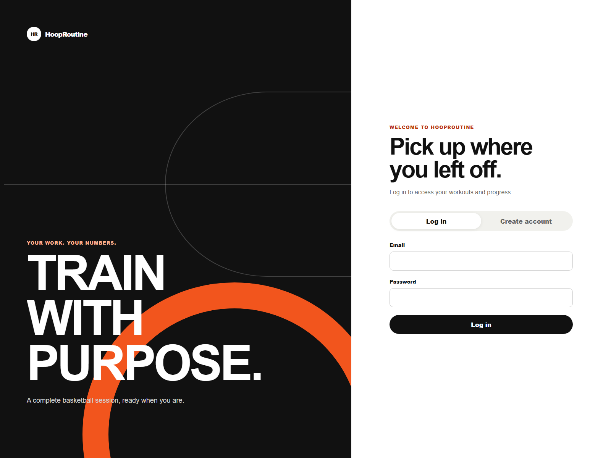
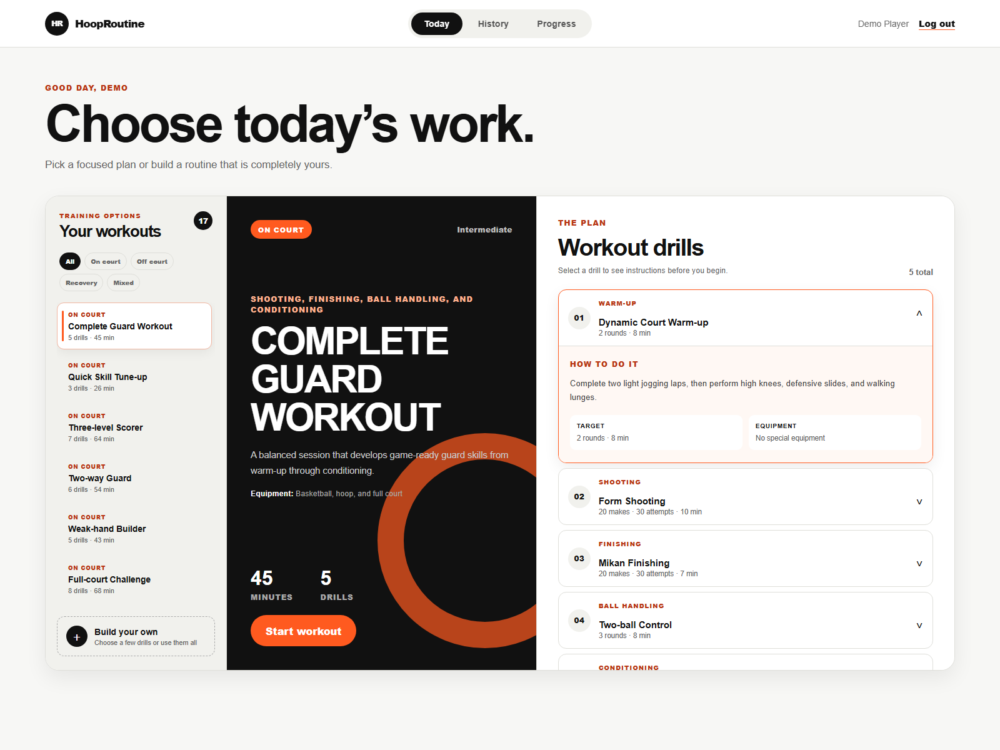

# HoopRoutine

[](AI-USAGE.md)

The project concept, original foundation, basketball routines, and feature direction came from the student. **OpenAI Codex** substantially assisted with implementation, debugging, tests, and documentation. See [AI-USAGE.md](AI-USAGE.md) for honest attribution and the still-unverified manually written code share. This is a disclosure badge, not a claim that the course badge has been awarded.

HoopRoutine is a full-stack basketball training app for players who want a prepared routine, the freedom to choose a training focus, and a simple way to record and review their work. The current Week 3 system includes authenticated accounts, 16 preset workouts, a 46-drill library, editable custom routines, active workout recording, whole-session timing, summaries, history, and progress statistics.

## Week 3 status

The Week 3 source changes are still local and uncommitted. A private backup was restored to an isolated PostgreSQL database, Migration 001 passed there, and the student then applied only Migration 001 to live Neon. The student's terminal showed the migration as `applied`, and a Neon count check matched the expected account, workout, drill, assignment, session, result, and snapshot totals. The live seed and reset were **not** run. The full post-migration app flow still needs a manual check.

### Implemented features

- Create an account with email validation and password confirmation, then log in and log out.
- Keep workout data connected to the authenticated player.
- Choose from sixteen preset workouts covering on-court skills, at-home ball handling, basketball strength, core and balance, defensive footwork, jump and landing fundamentals, and post-workout recovery.
- Filter workouts and drills by **On court**, **Off court**, **Recovery**, or **Mixed**, and review the equipment needed before starting.
- Expand any drill in the workout preview to read its instructions, target, and equipment before starting.
- Build and save a custom workout with any number of unique drills, including the entire drill library.
- Arrange custom drills in the exact order they should be completed.
- Edit the name, drill selection, and order of an existing custom routine without changing previous workout history.
- Keep custom routines private to the authenticated player.
- Delete a saved custom routine without removing previous workout history.
- Start or resume an unfinished workout.
- Cancel an unfinished workout and remove its saved draft results after confirmation.
- Record makes, attempts, repetitions, completed status, and notes for each drill.
- Automatically record the start time, finish time, and total duration for the whole workout.
- Finish a workout and save it to PostgreSQL.
- Review a completed session with shooting accuracy and workout totals.
- Browse completed and unfinished sessions in Workout History.
- Resume an unfinished workout from History.
- View accumulated workouts, training time, completed drills, accuracy trends, and category results in Progress.
- Use responsive layouts designed for common phone, tablet, and desktop widths.

### Remaining before submission

- Check login, workout saving, completion, History, and Progress end to end with the migrated database.
- Review the revised drill wording and decide separately whether to run the safe seed; the new instructions are not live until it is run.
- Refresh screenshots and check phone/tablet layout, keyboard use, and screen-reader behavior.
- Finish the slides, record the required video, and make the named 1080 × 1080 project image.
- Review [AI-USAGE.md](AI-USAGE.md) and [SECURITY-CHECKLIST.md](SECURITY-CHECKLIST.md), verify public links, and submit them in Canvas. Deployment is optional under the supplied finals instructions.

The [screenshot index](docs/screenshots/README.md), [five-slide presentation draft](docs/submission/HoopRoutine_Week3_Presentation.pptx), [video outline](docs/submission/DEMO_VIDEO_OUTLINE.md), and [square image draft](docs/submission/HoopRoutine_Project_Image.png) are available locally. The deck and image still need final edits before submission.

## Technology

- Client: React 18, Vite, React Router, and plain CSS
- Server: Node.js and Express
- Database: PostgreSQL
- Authentication: bcrypt password hashing, signed HTTP-only cookies, and revocable database sessions

## Setup and installation

### Requirements

- Node.js 22.12 or newer (this pass was checked with Node 24.21.0)
- npm
- PostgreSQL 17 or newer locally, or a compatible hosted PostgreSQL database
- An internet connection
- Git

### 1. Get the code

```bash
git clone https://github.com/Jaycenn/Hoop-Routine.git
cd Hoop-Routine
```

### 2. Create the PostgreSQL database

For Neon, create a PostgreSQL project, open **Connect**, and copy the connection string. Keep it private; never paste it into a public file or commit it. For a local database, this repository also has `compose.yml`. From the repository root in PowerShell, replace the example password and run:

```powershell
$env:POSTGRES_PASSWORD = 'choose-a-private-local-password'
docker compose up -d db
```

Then set `DATABASE_URL=postgresql://postgres:<your-password>@localhost:5432/hooproutine` and `DATABASE_SSL=false` in `server/.env`, using the same password. Docker is optional; any compatible local PostgreSQL instance works. URL-encode reserved characters in a password when placing it in the connection string.

### 3. Configure the server

```powershell
cd server
npm install
Copy-Item .env.example .env
```

Update `server/.env`:

```env
PORT=3001
DATABASE_URL="PASTE_YOUR_PRIVATE_NEON_CONNECTION_STRING_HERE"
JWT_SECRET=replace-this-with-at-least-32-random-characters
CORS_ORIGINS=http://localhost:5173,http://127.0.0.1:5173
COOKIE_SAME_SITE=lax
DATABASE_SSL=true
NODE_ENV=development
TRUST_PROXY_HOPS=0
```

Generate your own signing secret, for example with `node -e "console.log(require('node:crypto').randomBytes(32).toString('hex'))"`. Do not copy the placeholder as a real secret. For local PostgreSQL use `DATABASE_SSL=false`; remote connections require verified TLS. Optional `DATABASE_CA` supplies a private-provider CA PEM. Keep `TRUST_PROXY_HOPS=0` locally; set an exact trusted proxy count only when the hosting topology is known.

On macOS/Linux, use `cp .env.example .env` instead of `Copy-Item`. Keep existing private `.env` files; do not overwrite working credentials.

For a **new empty database**, initialize the schema, apply ordered migrations, and seed definitions:

```powershell
npm run db:schema
npm run db:seed
```

**Existing database upgrade:** first run `npm run db:status` in `server/`. If Migration 001 is pending on that database, stop the API, make and test a private backup, rehearse on an isolated copy, then run `npm run db:migrate` only after review and approval. The migration stops if duplicate active sessions exist; it never merges or deletes them automatically. It snapshots existing session definitions and preserves legacy incomplete shooting measurements. Run `db:seed` only as a separate, reviewed choice when catalog or instruction updates are needed. **The student's live Neon database already reports Migration 001 as applied; do not rerun setup or reset on it.**

Do not use reset to upgrade. `db:reset` deletes data and is guarded by an explicit confirmation environment variable; it was not executed. Schema initialization and all migrations run transactionally. Migration checksums prevent changing a migration that was already applied.

### Maintenance safety and recovery

- `db:seed` adds missing catalog workouts/drills. For existing drills it refreshes **instructions and equipment only**. It keeps existing drill names, categories, classifications, and numerical targets.
- Every existing workout keeps its ID, title, ownership, active state, and metadata. Every existing drill assignment is preserved, including extra presets, custom ordering, and empty routines. Only workouts newly inserted by that seed receive catalog assignments. Adding drills to an existing routine requires a separate reviewed change.
- A seeded preset slug owned by a user or marked custom stops the entire seed transaction; it is never converted to a public preset.
- Migration and seed runners use the same advisory lock. Seeding also locks catalog tables while checking ownership and inserting definitions. Pause application writes during maintenance to avoid conflicts.
- Seeding checks all local migration checksums and refuses pending, changed, or unknown migration history. `db/run.js` accepts only the reviewed seed path; it is no longer a general SQL executor.
- Maintenance uses a 15-second connection timeout, 60-second server statement timeout, 5-second lock timeout, and 120-second idle-transaction timeout. Optional `MIGRATION_STATEMENT_TIMEOUT_MS` (1000–900000) and `MIGRATION_LOCK_TIMEOUT_MS` (100–60000) override the two operation budgets. The normal API's timeouts remain unchanged. No client query timer cuts off a multi-statement file before PostgreSQL can roll it back.
- Failed rollback or an uncertain commit discards the connection. No automatic retry occurs. A connection failure during `COMMIT` means its outcome is unknown, even if a subsequent rollback request returns successfully.
- `npm --prefix server run db:status` reads migration status without applying changes. After an uncertain commit, check the ledger/checksum and preserved records before deciding to retry. If seeding failed after a successful separate migration command, the migration remains applied. There is no automatic downgrade.
- New checksums normalize LF/CRLF line endings and accept old checksums from either format. Actual SQL edits still cause a mismatch. Repeated seeds may advance ID sequences even when existing rows keep their IDs; gaps are normal and are not deleted records.

Before any future live upgrade: verify the database target privately, stop writers, make a private backup, restore it to an isolated copy, rehearse the required migration, and compare original record contents as well as counts. Check status and obtain approval before applying a pending migration. Seed only after its own review and decision. Stop on any error. Do not use `db:reset` or `db:schema` for an existing database.

### 4. Configure the client

Open another terminal in the repository root:

```powershell
cd client
npm install
Copy-Item .env.example .env
```

Update `client/.env` to match the API port. The shipped default is:

```env
VITE_API_URL=http://localhost:3001/api
```

## How to run it

Start the API from `server/`:

```powershell
npm run dev
```

Start React from `client/` in a second terminal:

```powershell
npm run dev
```

Open `http://localhost:5173`. Vite uses strict port 5173 so it cannot silently move to a disallowed origin. The expected first screen is Log in/Create account. `GET http://localhost:3001/api/health` returns `{"status":"ok"}` when the database is reachable. Create an account, choose a preset workout or build a custom routine, and start recording drill results.

Existing private configurations may use a different API port; keep `PORT` and `VITE_API_URL` matched. Without `VITE_API_URL`, the client uses `/api`; the development proxy targets port 3001. In production, configure the frontend API URL or a same-origin `/api` reverse proxy, HTTPS origins, `NODE_ENV=production`, and suitable cookie settings. Cross-site cookies require `COOKIE_SAME_SITE=none` and HTTPS; browser third-party-cookie restrictions still apply.

## Current usage flow

1. Create an account by entering a valid email format and the same password twice, or log in with an existing account.
2. On **Today**, filter the workout list by **On court**, **Off court**, **Recovery**, or **Mixed**, then choose a routine and review its equipment requirements. Select any drill to expand its instructions.
3. To make a personal routine, select **Build your own**, enter a name, choose any number of drills or use **Select all**, arrange their order, and save it. Select **Edit routine** later to change its name, drills, or order.
4. Select **Start workout** on the chosen routine.
5. Enter the active drill's result and select **Save and continue**. On the last drill, **Save progress without finishing** keeps the session open. Makes require attempts. Enter whole rounds for drills prescribed in rounds. Unsaved edits are kept per drill in this browser tab; logging out or cancelling removes them.
6. If needed, select **Cancel workout** and confirm to delete the unfinished session.
7. Save other edited drills first, then select **Finish workout** on the last drill. Finishing can preserve an explicitly confirmed partial workout; at least one drill must be complete. The final drill and session completion save together.
8. Review the completed session, including its start time, finish time, and total duration, on **Workout Summary**.
9. Open **History** to revisit completed sessions or resume an unfinished one. Select **Load older sessions** to continue beyond the first 30.
10. Open **Progress** to review totals, recent accuracy, and category results.

## Current API endpoints

| Method | Path | Purpose |
| --- | --- | --- |
| `GET` | `/api/health` | Check the API and database connection |
| `POST` | `/api/auth/register` | Create an account and start a session |
| `POST` | `/api/auth/login` | Authenticate an existing account |
| `GET` | `/api/auth/me` | Return the authenticated user |
| `POST` | `/api/auth/logout` | Revoke this login session and clear its cookie |
| `GET` | `/api/workouts` | Return preset workouts and the authenticated player's custom routines |
| `GET` | `/api/workouts/today` | Return today's workout and ordered drills |
| `GET` | `/api/workouts/drills` | Return the available drill library |
| `POST` | `/api/workouts/custom` | Create an owned routine; JSON includes title, drillIds and a UUID requestId for safe retries |
| `PUT` | `/api/workouts/:workoutId` | Version an owned routine; same body contract as create, with a new requestId for each edit |
| `DELETE` | `/api/workouts/:workoutId` | Hide one owned custom routine while preserving its history |
| `POST` | `/api/sessions` | Start or resume a workout session |
| `GET` | `/api/sessions` | Return 30 owned sessions, newest ID first; use `?before=<nextCursor>` for older pages |
| `GET` | `/api/sessions/:sessionId` | Return one owned session and its drill results |
| `DELETE` | `/api/sessions/:sessionId` | Cancel and delete one owned unfinished session |
| `PATCH` | `/api/sessions/:sessionId/drills/:drillId` | Save one drill result |
| `POST` | `/api/sessions/:sessionId/complete` | Complete idempotently; optional finalResult contains drillId and result to save atomically |
| `GET` | `/api/progress` | Return totals, recent accuracy, and category results |

## Project structure

```text
Hoop-Routine/
├── client/
│   └── src/
│       ├── components/    reusable interface pieces
│       ├── context/       authentication state
│       ├── pages/         account, workout, summary, history, and progress screens
│       ├── api.js         API request helper
│       └── styles.css     shared and responsive styles
├── server/
│   ├── db/                schema, seed data, and database pool
│   ├── lib/               authentication, validation, and time helpers
│   ├── routes/            current REST API routes
│   └── test/              validation, HTTP, transaction, and opt-in database tests
├── REPORT.md              current weekly increment report
└── WEEK-PLAN.md           planned development increments
```

## Validation and security

- Passwords are hashed with bcrypt.
- Account creation requires matching password entries.
- Email addresses are normalized, checked for a valid format, and prevented from being reused by another account.
- Authentication uses an HTTP-only cookie.
- SQL queries use parameters.
- Workout sessions are restricted by the authenticated user's ID.
- Custom routines are restricted by their authenticated owner's ID.
- Custom workout names must contain 3–80 characters.
- Custom workouts must contain at least one unique, valid drill; the full drill library is allowed.
- Numeric results must be non-negative whole numbers.
- Makes require attempts and cannot exceed them; integer inputs are bounded by database limits.
- New passwords must fit bcrypt's 72-byte UTF-8 limit. Existing long passwords remain usable to preserve account access; users of those legacy passwords should choose a new password when password-change support is available.
- Login/registration have bounded in-memory rate limits. Multi-instance deployment requires a shared limiter at the gateway.
- A session snapshot preserves its original drill instructions and targets across later definition edits.
- Notes are limited to 500 characters.

## Checks

From the project root:

```powershell
npm test
npm run check
```

The default tests use isolated fixtures and do not read private environment files or connect to the real database. The test-only PGlite dependency runs the actual migration/seed SQL in ephemeral, in-memory PostgreSQL instances, with no database directory or network connection. It covers legacy data preservation, repeat runs, ownership conflicts, failed upgrades, rollback, and migration history checks. Fake connections cover uncertain commits and cleanup failures. HTTP tests open a temporary localhost port. `npm run check` also performs server syntax checks and creates the client build in ignored `client/dist`.

The separate multi-connection PostgreSQL integration test is skipped by default. To run it, first create a disposable **local database named hooproutine_test**, set `TEST_DATABASE_URL` to that database and `RUN_DATABASE_TESTS=1`, then run `npm --prefix server test`. Never supply the development/hosted database. The test creates and removes its own randomly named schema; no production data is used.

## Known issues and next steps

- The isolated backup restore, Migration 001 rehearsal, and local API smoke checks passed. A complete post-migration walkthrough against live Neon is still needed for login, saving, completion, History, and Progress.
- The live seed has not run, so the revised 46 drill guides in `server/db/seed.sql` are not yet reflected in existing Neon drill rows. The separate multi-connection PostgreSQL integration suite is still optional verification; PGlite does not reproduce Neon networking or pooling.
- Registration checks email format and uniqueness, but email ownership verification by confirmation link or code is not implemented yet.
- The custom builder still needs keyboard, screen-reader, and physical-device testing.
- The app is not deployed yet.

## Finals submission status

The supplied course deadline for final project, presentation, and badge is **2026-10-09 at 23:59 (UTC+8), with no late window**. Review [SECURITY-CHECKLIST.md](SECURITY-CHECKLIST.md), [AI-USAGE.md](AI-USAGE.md), and the presentation/video drafts. Public repository visibility, the private class workspace link, final commit evidence, student authorship, the video, and Canvas/Drive submissions remain manual actions. This documentation edit did not commit, push, deploy, or submit anything.

## Screenshots

### Login and account creation



### Today’s Workout



The [Week 3 screenshot index](docs/screenshots/README.md) also includes the custom builder, active workout, Workout Summary, History, and Progress. These captures use a dedicated demo account with illustrative results and predate the October 9 changes. Refresh them after migration and a successful live walkthrough; they are not evidence that the updated flow has been runtime-verified.
